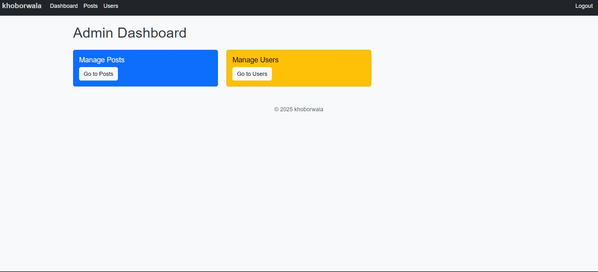
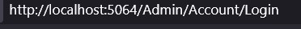

# KhoborWala

KhoborWala is a modern news publishing and blogging platform built with ASP.NET Core MVC. It allows users to read, create, and manage news posts across various categories such as National, International, Sports, and more. Authenticated users can create their own posts, view their personal post history, and receive notifications for interactions. The project features a clean, responsive Bootstrap-based UI, user authentication, role-based admin panel, and a notification system for post reactions.

---

## Features

- Read news and blog posts by category (National, International, Sports, etc.)
- User registration, login, and profile management
- Authenticated users can create, edit, and delete their own posts
- "My Posts" section for users to view their own posts
- Like/react to posts, with notifications sent to post owners
- Admin panel for managing users, posts, and categories
- Responsive Bootstrap UI for desktop and mobile
- Post will be seen in Trending and Latest as per Trend and Post Time

---

## Screenshots

Add screenshots of your project here:





---

## Project Structure

```
KhoborWala/
├── appsettings.Development.json
├── appsettings.json
├── LICENSE
├── MediumClone.csproj
├── MediumClone.sln
├── Program.cs
├── README.md
├── Areas/
│   ├── Admin/
│   │   ├── Controllers/
│   │   ├── Models/
│   │   └── Views/
│   └── Identity/
├── assets/
├── bin/
├── Controllers/
├── MediumClone/
├── Migrations/
├── Models/
├── obj/
├── Properties/
├── Views/
│   ├── Home/
│   ├── Post/
│   ├── Shared/
│   └── User/
└── wwwroot/
    ├── css/
    ├── js/
    └── lib/
```

---

## Getting Started

### Prerequisites

- [.NET 9 SDK](https://dotnet.microsoft.com/en-us/download/dotnet/9.0)
- SQL Server (or change connection string for your DB)
- Node.js (for front-end asset management, optional)

### Installation

1. **Clone the repository:**

   ```bash
   git clone https://github.com/yourusername/KhoborWala.git
   cd KhoborWala
   ```

2. **Restore NuGet packages:**

   ```bash
   dotnet restore
   ```

3. **Apply database migrations:**

   ```bash
   dotnet ef database update
   ```

4. **Run the application:**

   ```bash
   dotnet run
   ```

5. **Open in browser:**

   Visit `https://localhost:5001` or `http://localhost:5000`

6. **Admin Credential:**

   ```text
   Email: admin@blog.com
   Pass: Admin@123
   ```

---

## Usage

- Register a new account or log in.
- Browse posts by category or view trending/latest posts.
- Create, edit, or delete your own posts from the "My Posts" section.
- Like/react to posts and receive notifications.
- Admins can manage users, posts, and categories from the admin panel.

---

## Contributing

Pull requests are welcome! For major changes, please open an issue first to discuss what you would like to change.

---

## License

This project is licensed under the MIT License.

---

## Contact

For questions or support, open an issue or contact the maintainer at [imrannazirudoy@gmail.com].

---

## Credits

- Built with ASP.NET Core MVC
- UI powered by Bootstrap

---

> **Tip:** Add your own screenshots to the `assets/` folder and update the links above if you add more images.
